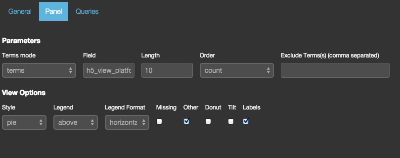
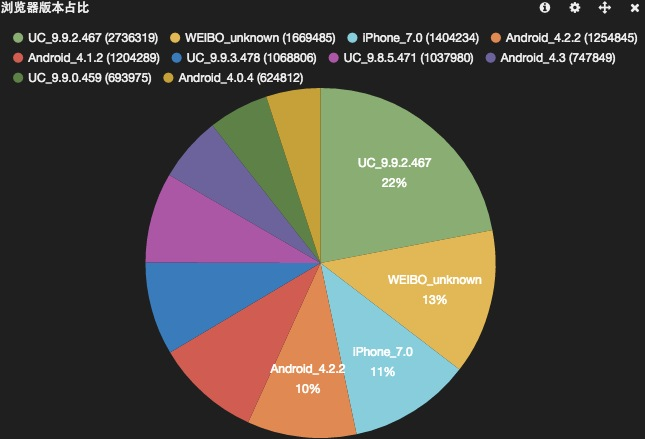
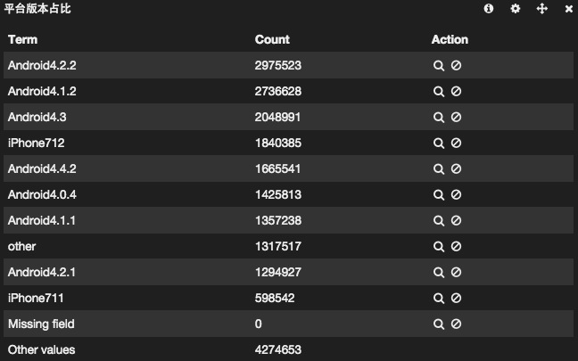

# terms

状态：稳定

基于 Elasticsearch 的 terms facet 接口数据展现表格，条带图，或者饼图。

## 参数

* field

    用于计算 facet 的字段名称。

* script

    用于提交 facet 的 scriptField 脚本字符串。系我的 fork 中新增的功能，仅在 fmode 为 script 时生效。

* exclude

    要从结果数据中排除掉的 terms

* missing

    设为假，就可以不显示数据集内有多少结果没有你指定的字段。

* other

    设为假，就可以不显示聚合结果在你的 `size` 属性设定范围以外的总计数值。

* size

    显示多少个 terms

* order

    terms 模式可以设置：count, term, reverse_count 或者 reverse_term；terms_stats 模式可以设置：term, reverse_term, count, reverse_count, total, reverse_total, min, reverse_min, max, reverse_max, mean 或者 reverse_mean

* donut

    在饼图(pie)模式，在饼中画个圈，变成甜甜圈样式。

* tilt

    在饼图(pie)模式，倾斜饼变成椭圆形。

* lables

    在饼图(pie)模式，在饼图分片上绘制标签。

* arrangement

    在条带(bar)或者饼图(pie)模式，图例的摆放方向。可以设置：水平(horizontal)或者垂直(vertical)。

* chart

    可以设置：table, bar 或者 pie

* counter_pos

    图例相对于图的位置，可以设置：上(above)，下(below)，或者不显示(none)。

* spyable

    设为假，不显示审查(inspect)按钮。

**请求(queries)**

* 请求对象

    这个对象描述本面板使用的请求。

  * queries.mode

    在可用请求中应该用哪些？可设选项有：`all, pinned, unpinned, selected`

  * queries.ids

    如果设为 `selected` 模式，具体被选的请求编号。

* tmode

    Facet 模式：terms 或者 terms_stats。

* fmode

    Field 模式：normal 或者 script。我的 fork 中新增参数，normal 行为和原版一致，选择 script 时，scriptField 参数生效。

* tstat

    Terms_stats facet stats 字段。

* valuefield

    Terms_stats facet value 字段。

-----------------------------

## 界面配置说明

terms 面板是针对单项数据做聚合统计的面板。可配置项比较简单：

主要分为两部分，数据模式和显示风格。

### 数据模式

terms 面板能够使用两种数据模式(也是 Kibana 大多数面板所使用的)：

* terms

terms 即普通的分类计数(类比为 `group by` 语法)。填写具体字段名即可。此外，排序(`order by`)和结果数(`limit`)也可以定义，具体选项介绍见本页前半部分。

* terms_stats

terms_stats 在 terms 的基础上，获取另一个数值类型字段的统计值作为显示内容。可选的统计值有：count, total_count, min, max, total, mean。最常用的就是 mean。

### 显示风格

terms 面板可以使用多个风格来显示数据。

* bar

* pie

这时候可能就会觉得这个 "other value" 太大了，又不关心它。那么可以在配置里去掉 other 的勾选。图形会变成这样：

如果勾选 "donut"，则可以看到圈圈饼效果：

* table

如果你是个对数字敏感的人，或者主要数据差距不大，通过 bar 或者 pie 方式不是很明显，那么看表格最好了：

注意这个表格只有单列数据，使用配置里定义的排序，不像 table 面板。

如果你需要同时看多种统计数据，则应该使用 [stats 面板](./stats.md)。

### script field

在 fmode 选择 script 的时候，可以填写 script 脚本字符串获取脚本化字段结果做聚合。

在 scriptField 输入框中输入

    doc['path.raw'].value

的时候，效果完全等价于直接在 Field 输入框中输入

    path.raw

因为 script 和 analyzer 的次序关系，**务必使用带有 "not_analyzed" 属性的字段**。否则一条数据中只会有一个分词结果参与后续聚合运算。

支持的 script 语法，请参阅 ES 官方文档：<http://www.elasticsearch.org/guide/en/elasticsearch/reference/3.0/modules-scripting.html#_document_fields>

需要注意的是，出于安全考虑，ES 1.4 以下 大多建议关闭动态脚本运行的支持；在 1.4 新增了沙箱运行并设置为默认。所以，建议在 ES 1.4 的前提下使用该特性。
